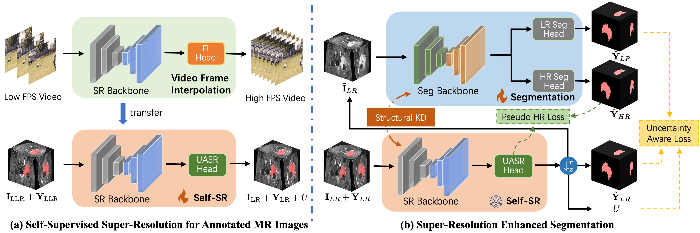

## REHRSeg: Unleashing the power of self-supervised super-resolution for resource-efficient 3D MRI segmentation

**Official PyTroch implementation of the *Neurocomputing 2025* paper**<br></sub>

<div align="center">
  
</div>

**REHRSeg: Unleashing the power of self-supervised super-resolution for resource-efficient 3D MRI segmentation**<br>
Zhiyun Song, Yinjie Zhao, Xiaomin Li, Manman Fei, Xiangyu Zhao, Mengjun Liu, Cunjian Chen, Chung-Hsing Yeh, Qian Wang, Guoyan Zheng, Songtao Ai, Lichi Zhang<br>

Abstract: *High-resolution (HR) 3D magnetic resonance imaging (MRI) can provide detailed anatomical structural information, enabling precise segmentation of regions of interest for various medical image analysis tasks. Due to the high demands of acquisition device, collection of HR images with their annotations is always impractical in clinical scenarios. Consequently, segmentation results based on low-resolution (LR) images with large slice thickness are often unsatisfactory for subsequent tasks. In this paper, we propose a novel Resource-Efficient High-Resolution Segmentation framework (REHRSeg) to address the above-mentioned challenges in real-world applications, which can achieve HR segmentation while only employing the LR images as input. REHRSeg is designed to leverage self-supervised super-resolution (self-SR) to provide pseudo supervision, therefore the relatively easier-to-acquire LR annotated images generated by 2D scanning protocols can be directly used for model training. The main contribution to ensure the effectiveness in self-SR for enhancing segmentation is three-fold: (1) We mitigate the data scarcity problem in the medical field by using pseudo-data for training the segmentation model. (2) We design an uncertainty-aware super-resolution (UASR) head in self-SR to raise the awareness of segmentation uncertainty as commonly appeared on the ROI boundaries. (3) We align the spatial features for self-SR and segmentation through structural knowledge distillation to enable a better capture of region correlations. Experimental results demonstrate that REHRSeg achieves high-quality HR segmentation without intensive supervision, while also significantly improving the baseline performance for LR segmentation.*

## Release notes

This repository is built upon [nnUNet](https://github.com/MIC-DKFZ/nnUNet) and [FLAVR](https://github.com/tarun005/FLAVR) for the combination of super-resolution and segmentation tasks.

## Requirements

* We recommend Linux for performance and compatibility reasons.
* 1 high-end NVIDIA GPU with at least 24 GB of memory.
* 64-bit Python 3.9 and PyTorch 2.1.2. See [https://pytorch.org/](https://pytorch.org/) for PyTorch install instructions. One way to install Pytorch 2.1.2, which has been verify by the author, is:
`pip install torch==2.1.2 torchvision==0.16.2 torchaudio==2.1.2 --index-url https://download.pytorch.org/whl/cu118`
*  Other dependencies: `pip install -r requirements.txt`

## Preparing

### Dataset Downloading
The original Meningioma-SEG-CLASS dataset is available at [https://www.cancerimagingarchive.net/collection/meningioma-seg-class](https://www.cancerimagingarchive.net/collection/meningioma-seg-class)

Due to the region availability, you can also download the preprocessed dataset (after normalization, reformatting, and downsampling) in the following link:

#### Google Drive
Link: [https://drive.google.com/drive/folders/1uqcp5dhKgF1xrvOpYvj0Nl-Fsg4RaMEh?usp=drive_link](https://drive.google.com/drive/folders/1uqcp5dhKgF1xrvOpYvj0Nl-Fsg4RaMEh?usp=drive_link)

#### Baidu Netdisk
Link：[https://pan.baidu.com/s/1y0LbeVthbI1SEtkx0js3HQ](https://pan.baidu.com/s/1y0LbeVthbI1SEtkx0js3HQ)
Extraction Code (提取码)：beed  

where
- Meningioma.tgz is the original dataset
- Meningioma_converted_preprocessed.zip is the preprocessed high-resolution dataset
- Meningioma_converted_preprocessed_lr.zip is the downsampled low-resolution dataset

### Dataset Preparation

We use [nnUNet](https://github.com/MIC-DKFZ/nnUNet) for the preparation of dataset and initializing nnUNet. For example, our codes to prepare the Meningioma-SEG-CLASS dataset are:
```.bash
nnUNetv2_plan_and_preprocess -d 509 --verify_dataset_integrity
nnUNetv2_train 509 3d_fullres all
```

### Pretrained Weight

Please also prepare the pretrained FLAVR model to initialize the super-resolution process:
```.bash
cd ../
git clone https://github.com/tarun005/FLAVR.git
```
Then download the pretrained [4x frame-interpolation model](https://drive.google.com/file/d/1GARJK0Ti1gLH_O0spxAEqzbMwUKqE37S/view?usp=sharing) and put it into ~/FLAVR/checkpoints.

## Getting started
For the Meningioma-SEG-CLASS dataset, you can follow our settings with
```.bash
python train_all.py --config ./configs/brain.yml --fold x
```
where x is the fold index.

## Citation
```
@article{SONG2025129425,
title = {REHRSeg: Unleashing the power of self-supervised super-resolution for resource-efficient 3D MRI segmentation},
journal = {Neurocomputing},
volume = {624},
pages = {129425},
year = {2025},
issn = {0925-2312},
author = {Zhiyun Song and Yinjie Zhao and Xiaomin Li and Manman Fei and Xiangyu Zhao and Mengjun Liu and Cunjian Chen and Chung-Hsing Yeh and Qian Wang and Guoyan Zheng and Songtao Ai and Lichi Zhang},
}
```

## Development

This is a research reference implementation and is treated as a one-time code drop. As such, we do not accept outside code contributions in the form of pull requests.

